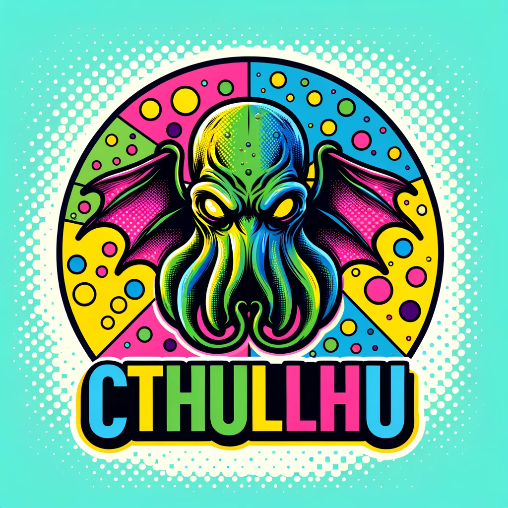

# Practice Top Page

よく使う記法を書いておきます。
(このページは削除してもらって大丈夫です。)

## Basic

### リンク

[Guide](/guide/)

```
[Guide](/guide/)
```

### 画像



```

```

### Table

| name |    value     |         memo |
| ---- | :----------: | -----------: |
| 1    |     1-1      |        memo1 |
| 2    |     1-2      |        memo2 |
| 3    | longlonglong | longlonglong |

```
| name |    value     |         memo |
| ---- | :----------: | -----------: |
| 1    |     1-1      |        memo1 |
| 2    |     1-2      |        memo2 |
| 3    | longlonglong | longlonglong |
```

## Advance

### Custom Containers

::: info
This is an info box.
:::

::: tip
This is a tip.
:::

::: warning
This is a warning.
:::

::: danger
This is a dangerous warning.
:::

::: details
This is a details block.
:::

```
::: info
This is an info box.
:::

::: tip
This is a tip.
:::

::: warning
This is a warning.
:::

::: danger
This is a dangerous warning.
:::

::: details
This is a details block.
:::
```

### Syntax

**Input**

````
```js
export default {
  name: 'MyComponent',
  // ...
}
```
````

**Output**

```js
export default {
  name: "MyComponent",
  // ...
};
```
